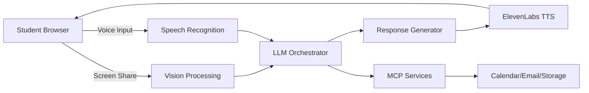

# 🎓 Asian Parent Math Tutor AI

**Cursor Hackathon Singapore 2024**

> *"Why you get B+? You want to be failure in life ah?"* - Your AI Tiger Mom

## 🚀 Project Overview

An innovative multimodal AI tutoring system that combines screen-sharing, voice interaction, and computer vision to create a memorable math tutoring experience styled after the stereotypical Asian Tiger Parent. This project satirizes the intense tutoring style many Asian students experienced growing up, while actually providing effective math education.

### 🎯 Hackathon Theme Alignment
- **Memorable & Unique**: Stands out through humor and cultural relatability
- **Technical Showcase**: Demonstrates advanced multimodal AI integration
- **Sponsor Track Integration**: Leverages ElevenLabs, MCP, and other sponsor technologies

## 👥 Team

- [Your Name] - [Role]
- [Teammate Name] - [Role]

## 🎭 Core Concept

The Asian Parent Math Tutor is an AI companion that:
1. **Watches** your screen as you solve math problems (computer vision)
2. **Listens** to your questions and explanations (voice input)
3. **Responds** in the style of a stereotypical Asian parent (with actual helpful guidance)
4. **Tracks** your progress and "reports to your parents"

### Key Personality Traits
- Compares you to fictional overachieving cousins
- Expresses disappointment at mistakes (humorously)
- Reluctantly gives praise when you succeed
- Actually provides helpful step-by-step guidance
- Switches between English and Asian exclamations ("Aiya!", "Walao!", "Haiya!")

## 🛠 Technical Architecture

### Core Tech Stack

```
Frontend:
├── Next.js/React - Web application
├── WebRTC - Screen sharing & voice capture
├── TailwindCSS - Styling
└── Canvas API - Real-time annotations

Backend:
├── Node.js/Express - WebSocket server
├── Python FastAPI - AI orchestration (optional)
└── WebSocket - Real-time communication

AI/ML Services:
├── GPT-4 Vision - Math problem recognition
├── Whisper/Deepgram - Speech to text
├── GPT-4/Claude - Response generation
└── ElevenLabs - Text to speech (Asian Mom voice)

Infrastructure:
├── MCP (Model Context Protocol) - External service integration
├── Vercel/Railway - Deployment
└── Supabase/Neon - Database (if needed)
└── Docker - Containerization (optional)
```

### System Architecture



## 🎯 Feature Set

### MVP Features (Priority 1) - First 12 Hours

#### 1. Screen Capture & Math Recognition
- Capture student's screen showing math work
- Use GPT-4V to identify math problems and mistakes
- Real-time error detection

#### 2. Voice Interaction Pipeline
- Voice input from student (questions/responses)
- Speech-to-text processing
- Text-to-speech with "Asian Mom" personality

#### 3. Core Personality Responses
- Mistake detection → Disappointment escalation
- Success detection → Reluctant praise
- Random cousin comparisons
- Cultural exclamations and phrases

#### 4. Basic Tutoring Logic
- Step-by-step problem solving
- Mistake correction with explanation
- Hints when student is stuck

### Extended Features (Priority 2) - If Time Permits

#### 5. Focus Detection
- Webcam integration to detect if student looks away
- "Oi! Pay attention!" responses

#### 6. Progress Tracking (via MCP)
- Session history storage
- Performance metrics
- "Improvement" or "Disappointment" trends

#### 7. Parent Reporting System
- Email reports to "parents" (demo email)
- Weekly progress summaries
- Areas of concern highlighting

#### 8. Advanced Personality Features
- Mood system (gets angrier with repeated mistakes)
- Rare "proud moment" triggers
- Food-based rewards ("Okay lah, you can have bubble tea")

### Stretch Goals (Priority 3)

- Multiple subject support
- Difficulty adaptation
- Multiplayer mode (compete with "cousins")
- Mobile app version
- Different parent personalities (Dad mode, Grandma mode)

## 💻 Implementation Plan

### Phase 1: Setup (Hour 0-2)
- [ ] Repository setup and team access
- [ ] Development environment configuration
- [ ] Basic Next.js app with routing
- [ ] API keys and service setup

### Phase 2: Core Infrastructure (Hour 2-6)
- [ ] Screen capture implementation
- [ ] Voice recording setup
- [ ] WebSocket server for real-time communication
- [ ] Basic UI layout

### Phase 3: AI Integration (Hour 6-12)
- [ ] GPT-4V integration for math recognition
- [ ] Speech-to-text pipeline
- [ ] LLM prompt engineering for personality
- [ ] ElevenLabs voice generation

### Phase 4: Feature Development (Hour 12-18)
- [ ] Core tutoring logic
- [ ] Personality response system
- [ ] MCP integration for external services
- [ ] Progress tracking

### Phase 5: Polish & Demo (Hour 18-24)
- [ ] Bug fixes and testing
- [ ] Demo script preparation
- [ ] Presentation slides
- [ ] Deploy to production

## 🔧 Development Setup

### Prerequisites
```bash
- Node.js 18+
- npm/yarn/pnpm
- Git
- API Keys for: OpenAI, ElevenLabs, [other services]
```

### Installation
```bash
# Clone repository
git clone https://github.com/[your-username]/asian-parent-tutor.git
cd asian-parent-tutor

# Install dependencies
npm install

# Setup environment variables
cp .env.example .env.local
# Add your API keys to .env.local

# Run development server
npm run dev
```

### Environment Variables
```env
OPENAI_API_KEY=
ELEVENLABS_API_KEY=
DEEPGRAM_API_KEY=
SUPABASE_URL=
SUPABASE_ANON_KEY=
```

## 🎮 Demo Scenarios

### Scenario 1: Basic Math Mistake
1. Student writes 2+2=5
2. AI: "Haiya! 2+2=5? My friend's son only 5 years old already know this!"
3. Guides through correct solution
4. "See? Not so hard when you ACTUALLY USE YOUR BRAIN"

### Scenario 2: Getting Stuck
1. Student struggles with algebra
2. AI: "Why you just staring? The answer won't appear by magic!"
3. Provides hint
4. "Your cousin Marcus would have solved this already"

### Scenario 3: Success Moment
1. Student solves difficult problem correctly
2. AI: *long pause* "Hmm... not bad lah. But don't get cocky"
3. "Maybe you're not completely hopeless"

## 🏆 Judging Criteria Alignment

- **Innovation**: First multimodal AI tutor with personality
- **Technical Complexity**: Vision + Voice + LLM + TTS pipeline
- **Memorability**: Unique cultural angle that resonates
- **Execution**: Working demo with multiple features
- **Sponsor Integration**: Heavy use of ElevenLabs, MCP, and other sponsors

## 📝 Notes for Team

### Communication
- Discord/Slack for team chat
- GitHub Issues for task tracking
- Regular sync every 3-4 hours

### Code Style
- ESLint configuration included
- Prettier for formatting
- Component-based architecture
- Clear function documentation

### Git Workflow
- `main` branch for stable code
- Feature branches for development
- PR reviews before merging (if time permits)

## 🚧 Known Challenges & Solutions

| Challenge | Solution |
|-----------|----------|
| Voice latency | Pre-generate common responses |
| Screen capture performance | Reduce frame rate, optimize image size |
| Personality consistency | Well-defined prompt templates |
| Time constraint | Focus on MVP, add features incrementally |

## 📚 Resources

- [MCP Documentation](https://modelcontextprotocol.io/)
- [ElevenLabs Voice API](https://elevenlabs.io/docs)
- [GPT-4 Vision Guide](https://platform.openai.com/docs/guides/vision)
- [WebRTC Screen Sharing](https://developer.mozilla.org/en-US/docs/Web/API/Screen_Capture_API)

## 🎯 Success Metrics

- [ ] Working screen share with math recognition
- [ ] Voice interaction loop complete
- [ ] At least 5 personality responses implemented
- [ ] Successfully integrated 3+ sponsor technologies
- [ ] Audience laughs during demo
- [ ] Judges remember our project

---

**Remember**: The goal is to be memorable AND technically impressive. When in doubt, add more Asian parent personality! 

*"You think hackathon is game ah? Code properly or become disappointment!"* - Your AI Tiger Mom